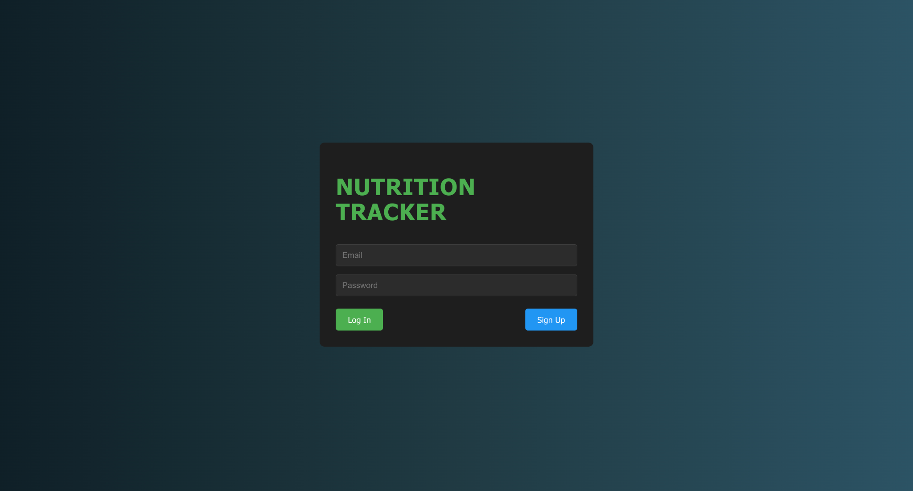
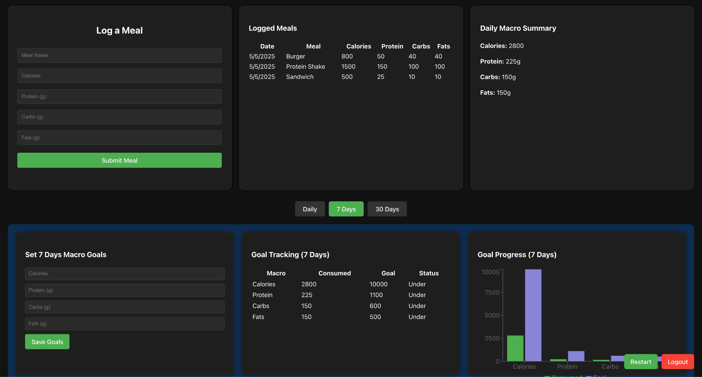

# Nutrition Tracker Capstone Project
By Seth Projain
A full-stack web application that allows users to log meals, track macros (calories, protein, carbs, fats), and set personalized nutrition goals.

# Tech Stack
- React.js (Frontend)
- Node.js (Backend)
- MySQL (Database)
- Firebase Authentication

# Features
- User authentication (login/signup)
- Meal logging system
- Daily macro tracking (calories, protein, carbs, fats)
- Goal setting (daily, 7-day, 30-day)
- Macro progress visualization (chart-based)

# Purpose
This project was developed as a senior capstone to demonstrate full-stack development, database integration, and user-focused design.

# Potential (Not Implemented) 
- Barcode scanner for food input
- AI-based meal suggestions
- Enhanced data visualization

# Login Page

# Dashboard

